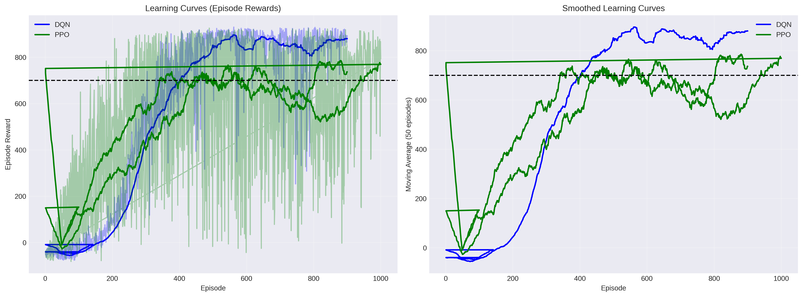
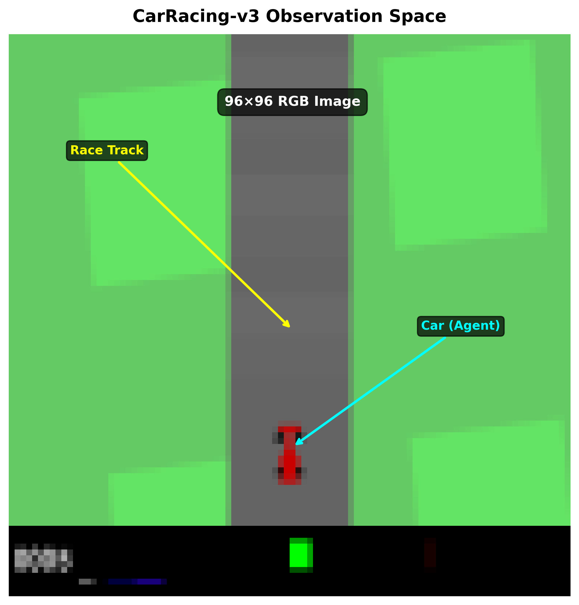
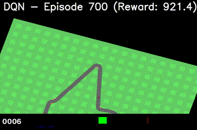
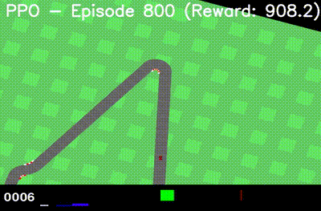
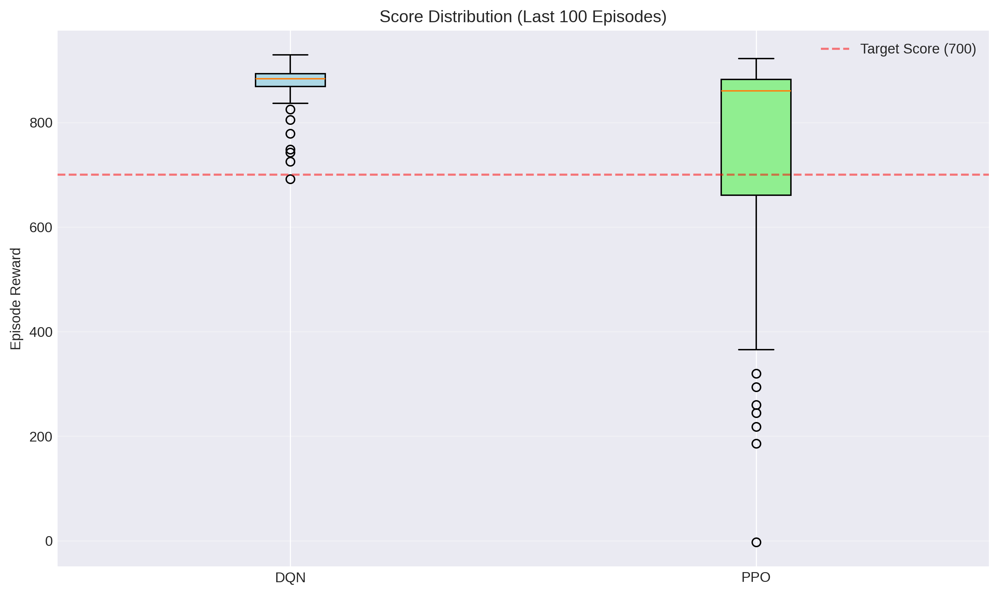
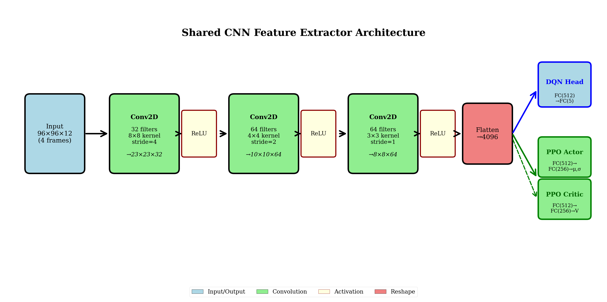

# Deep Reinforcement Learning: DQN vs PPO on CarRacing-v3

A comprehensive empirical comparison of Deep Q-Network (DQN) and Proximal Policy Optimization (PPO) algorithms on the CarRacing-v3 environment, focusing on discrete vs. continuous action space representations.



## Overview

This project implements and compares two prominent deep RL algorithms on a visual control task:
- **DQN** with discrete actions (5 actions)
- **PPO** with continuous actions (3D control vector)

Both algorithms use the same CNN architecture for fair comparison, varying only in action space representation and learning dynamics.

## Environment: CarRacing-v3



**Observation Space:** 96×96 RGB images  
**Discrete Actions (DQN):** No-op, Left, Right, Gas, Brake  
**Continuous Actions (PPO):** [Steering, Gas, Brake] ∈ ℝ³  
**Reward:** -0.1 per frame + 1000/N per tile visited  
**Preprocessing:** Frame stacking (4 frames) + Frame skipping (2 frames)

## Agent Demonstrations

### DQN Agent (Episode 900)


*DQN achieving stable racing with discrete actions*

### PPO Agent (Episode 900)


*PPO navigating with continuous control*

## Key Results

### Performance Summary

| Metric | DQN | PPO |
|--------|-----|-----|
| **Final Mean Score** (last 100 episodes) | **877.86 ± 40.24** | 752.43 ± 199.79 |
| **Overall Mean** | 573.95 ± 371.85 | 569.05 ± 307.22 |
| **Max Score** | **930.20** | 925.80 |
### Learning Dynamics



**Key Findings:**
- **DQN achieved superior final performance**: 877.86 vs 752.43
- **DQN demonstrated better stability**: σ = 40.24 vs σ = 199.79
- **PPO showed smoother early learning** but higher variance later
- **Neither algorithm converged** within 900 episodes (target: mean ≥ 700, σ ≤ 10)

## Architecture

### Shared CNN Feature Extractor



Both algorithms use the Nature DQN architecture:
```
Input: 96×96×12 (4 stacked RGB frames)
  ↓
Conv2D(32, 8×8, stride=4) + ReLU  → 23×23×32
  ↓
Conv2D(64, 4×4, stride=2) + ReLU  → 10×10×64
  ↓
Conv2D(64, 3×3, stride=1) + ReLU  → 8×8×64
  ↓
Flatten                            → 4096 features
  ↓
Algorithm-specific heads
```

## Quick Start

### Installation

```bash
# Clone repository
git clone https://github.com/brk-ilias/rf-car-racing.git
cd reinforcement-learning

# Create virtual environment
python -m venv .venv
source .venv/bin/activate  # On Windows: .venv\Scripts\activate

# Install dependencies
pip install -r requirements.txt
```

### Training

```bash
# Train DQN agent
python scripts/train_dqn.py

# Train PPO agent
python scripts/train_ppo.py
```

### Configuration

Modify hyperparameters in `configs/`:
- `dqn_config.yaml` - DQN-specific settings
- `ppo_config.yaml` - PPO-specific settings
- `base_config.yaml` - Shared configuration

## Project Structure

```
reinforcement-learning/
├── src/
│   ├── agents/          # DQN and PPO implementations
│   │   ├── dqn_agent.py
│   │   ├── ppo_agent.py
│   │   ├── replay_buffer.py
│   │   └── rollout_buffer.py
│   ├── models/          # Neural network architectures
│   │   ├── dqn.py
│   │   ├── ppo.py
│   │   └── shared_cnn.py
│   ├── envs/            # Environment wrappers
│   │   └── wrappers.py
│   └── utils/           # Helper functions
│       ├── checkpoint_manager.py
│       ├── evaluation.py
│       ├── logger.py
│       └── training_monitor.py
├── scripts/             # Training scripts
│   ├── train_dqn.py
│   └── train_ppo.py
├── configs/             # Configuration files
├── logs/                # Training logs and results
├── checkpoints/         # Model checkpoints
└── paper/              # LaTeX paper and presentation
    ├── main.tex
    ├── presentation.pptx
    └── figures/
```

## Methodology

### DQN (Deep Q-Network)
- **Type:** Value-based, off-policy
- **Buffer:** Experience replay (100K capacity)
- **Target Network:** Updated every 1000 steps
- **Exploration:** ε-greedy (1.0 → 0.01 over 125K steps)
- **Loss:** Huber loss
- **Batch Size:** 32
- **Learning Rate:** 1e-4

### PPO (Proximal Policy Optimization)
- **Type:** Policy gradient, on-policy
- **Buffer:** Rollout buffer (2048 steps)
- **Update Epochs:** 10 per rollout
- **Clipping:** ε = 0.2
- **GAE:** λ = 0.95
- **Entropy Coefficient:** 0.01
- **Batch Size:** 64
- **Learning Rate:** 3e-4

## Academic Paper

A complete NeurIPS-formatted paper is available in `paper/`:
- **Paper PDF:** `assets/project.pdf`
- **Presentation:** `assets/presentation.pdf`

## Results Visualization

All training metrics are logged with TensorBoard:
```bash
# View DQN training
tensorboard --logdir logs/dqn

# View PPO training
tensorboard --logdir logs/ppo
```

## License

This project is open source and available under the MIT License.

## Author

**Boudrik Ilias**
